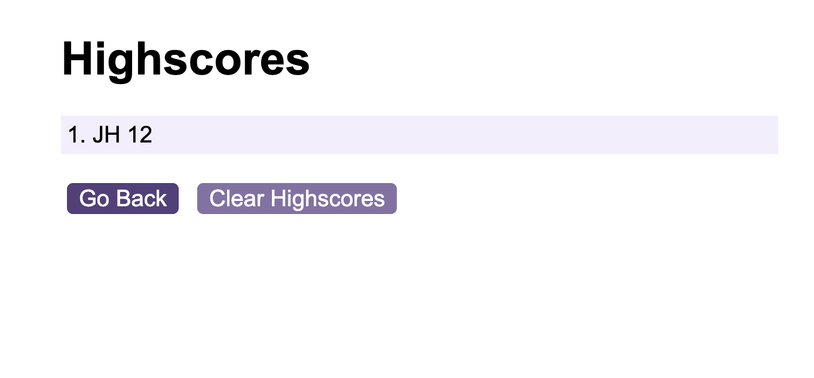

# code-quiz

## Description

This week’s challenge is to build a timed coding quiz with multiple-choice questions. This app will run in the browser and will have a clean, polished, and responsive user interface.

## Table of Contents

- [User Story](#user-story)
- [Acceptance Criteria](#acceptance-criteria)
- [Usage](#usage)
- [Credits](#credits)
- [License](#license)

## User Story

AS A coding boot camp student
I WANT to take a timed quiz on JavaScript fundamentals that stores high scores
SO THAT I can gauge my progress compared to my peers

## Acceptance Criteria

Create a code quiz that contains the following requirements:

* A start button that when clicked a timer starts and the first question appears.
 
  * Questions contain buttons for each answer.
  * When answer is clicked, the next question appears
  * If the answer clicked was incorrect then subtract time from the clock

* The quiz should end when all questions are answered or the timer reaches 0.

  * When the game ends, it should display their score and give the user the ability to save their initials and their score

## Usage

Link to deployed application - https://jakewshenry.github.io/code-quiz/

 

 

 

 

## Credits

This project was completed as part of an edX BootCamp coding challenge.

edX module slides - https://bootcampspot.instructure.com/courses/5076/modules

GitHub Pages README: https://coding-boot-camp.github.io/full-stack/github/professional-readme-guide

MDN If else statements - https://developer.mozilla.org/en-US/docs/Web/JavaScript/Reference/Statements/if...else

Quiz questions: https://www.sitepoint.com/simple-javascript-quiz/

MDN Local Storage - https://developer.mozilla.org/en-US/docs/Web/API/Window/localStorage

## License

This project is licensed under the MIT License.